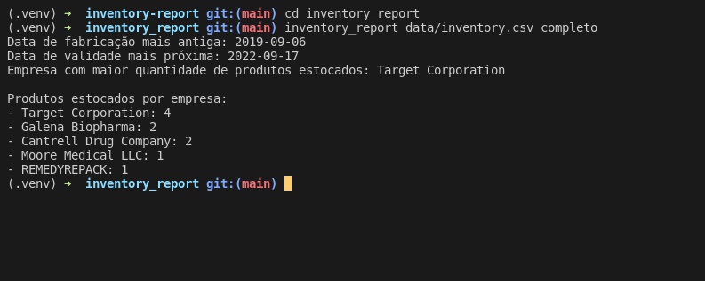

# Boas vindas ao repositório do projeto de Relatório de Estoque

Esse projeto foi desenvolvido como projeto avaliativo no módulo de Ciência da Computação, no curso de Desenvolvimento Web da [Trybe](https://www.betrybe.com/?utm_medium=cpc&utm_source=google&utm_campaign=Brand&utm_content=ad03_din_h), o objetivo desse projeto foi colocar em pratica meus conhecimentos em paradigmas de programação, programação orientada a objeto, criando classes e instâncias, e leitura e escrita de arquivos.

---

## Preview do projeto

## Sumário

- [Boas vindas ao repositório do projeto Task Organizer!](#boas-vindas-ao-repositório-do-projeto-task-organizer)
- [Estrutura de diretórios e arquivos](#Estrutura-de-diretórios-e-arquivos)
- [Desenvolvimento](#Desenvolvimento)
- [Como o projeto pode ser executável](#Como-o-projeto-pode-ser-executável)
- [Instalação do projeto localmente](#Instalação-do-projeto-localmente)
- [Classes e Métodos do projeto](#Classes-e-Métodos-do-projeto)
  - [Classe `SimpleReport`, Método `generate`](#Classe-SimpleReport-Método-generate)
  - [Classe `CompleteReport`, Método `generate`](#Classe-CompleteReport-Método-generate)
  - [Classe `Inventory`, Método `import_data`](#Classe-Inventory-Método-import_data)
  - [Classe `Inventory`, Métodos `import_csv`, `import_json`, `import_xml`](#Classe-Inventory-Métodos-import_csv-import_json-import_xml-)
  - [Classe `Importer`, Método `import_data`](#Classe-Importer-Método-import_data)
  - [Classes `CsvImporter`, `JsonImporter` e `XmlImporter`, Método `import_data`](#Classes-CsvImporter-JsonImporter-e-XmlImporter-Método-import_data)
  - [Classe `InventoryIterator`, Método `__next__`](#Classe-InventoryIterator-Método-__next__)
  - [Classe `InventoryRefactor`, Método `__iter__`](#Classe-InventoryRefactor-Método-__iter__)
  - [Classe `InventoryRefactor`, Método `import_data`](#Classe-InventoryRefactor-Método-import_data)
  - [Método `main`](#Método-main)
  - [Método `report_generator`](#Método-report_generator)
  - [Método `importer`](#Método-importer)
- [Link para o portfolio](#Link-para-o-portfolio)

---

### Estrutura de diretórios e arquivos

~~~bash
.
├── dev-requirements.txt
├── inventory_report
│   ├── data
│   │   ├── inventory.csv
│   │   ├── inventory.json
│   │   └── inventory.xml
│   ├── importer
│   │   ├── csv_importer.py
│   │   ├── importer.py
│   │   ├── json_importer.py
│   │   └── xml_importer.py
│   ├── inventory
│   │   ├── inventory_iterator.py
│   │   └── inventory.py
│   ├── main.py
│   └── reports
│       ├── complete_report.py
│       └── simple_report.py
├── pyproject.toml
├── README.md
├── requirements.txt
├── setup.cfg
├── setup.py
└── tests
    ├── __init__.py
    ├── test_complete_report.py
    ├── test_csv_importer.py
    ├── test_importer.py
    ├── test_inventory.py
    ├── test_json_importer.py
    ├── test_main.py
    ├── test_simple_report.py
    └── test_xml_importer.py
~~~

[Voltar ao sumário](#Sumário)

---

## Desenvolvimento

Esse projeto é um gerador de relatórios, que recebe como entrada arquivos com dados de um estoque e gera, como saída, um relatório acerca destes dados.

Esses dados de estoque são obtidos de diversas fontes:

- Através da importação de um arquivo `CSV`;

- Através da importação de um arquivo `JSON`;

- Através da importação de um arquivo `XML`;

Além disso, o relatório final pode ser gerado em duas versões: simples e completa.

[Voltar ao sumário](#Sumário)

---

## Dados

Arquivos de exemplo nos três formatos de importação estão disponíveis no diretório `data` dentro do diretório `inventory_report`.

### Importação de arquivos CSV

Os arquivos **CSV** são separados por vírgula, como no exemplo abaixo:

~~~csv
id,nome_do_produto,nome_da_empresa,data_de_fabricacao,data_de_validade,numero_de_serie,instrucoes_de_armazenamento
1,Nicotine Polacrilex,Target Corporation,2020-02-18,2022-09-17,CR25 1551 4467 2549 4402 1,morbi ut odio cras mi pede malesuada in imperdiet et commodo vulputate justo in blandit
2,fentanyl citrate,"Galena Biopharma, Inc.",2019-12-06,2022-12-25,FR29 5951 7573 74OY XKGX 6CSG D20,bibendum morbi non quam nec dui luctus rutrum nulla tellus in
3,NITROUS OXIDE,Keen Compressed Gas Co. Inc.,2019-12-22,2023-11-07,CZ09 8588 0858 8435 9140 2695,ipsum dolor sit amet consectetuer adipiscing elit proin risus praesent
~~~

### Importação de arquivos JSON

Os arquivos JSON seguem o seguinte modelo:

~~~json
[
  {
    "id":1,
    "nome_do_produto":"CALENDULA OFFICINALIS FLOWERING TOP, GERANIUM MACULATUM ROOT, SODIUM CHLORIDE, THUJA OCCIDENTALIS LEAFY TWIG, ZINC, and ECHINACEA ANGUSTIFOLIA",
    "nome_da_empresa":"Forces of Nature",
    "data_de_fabricacao":"2020-07-04",
    "data_de_validade":"2023-02-09",
    "numero_de_serie":"FR48 2002 7680 97V4 W6FO LEBT 081",
    "instrucoes_de_armazenamento":"in blandit ultrices enim lorem ipsum dolor sit amet consectetuer adipiscing elit proin interdum mauris non ligula pellentesque ultrices phasellus"
  }
]
~~~

### Importação de arquivos XML

Os arquivos **XML** seguem o seguinte modelo:

~~~xml
<?xml version='1.0' encoding='UTF-8'?>
<dataset>
  <record>
    <id>1</id>
    <nome_do_produto>valsartan and hydrochlorothiazide</nome_do_produto>
    <nome_da_empresa>Lake Erie Medical &amp; Surgical Supply DBA Quality Care Products LLC</nome_da_empresa>
    <data_de_fabricacao>2019-10-27</data_de_fabricacao>
    <data_de_validade>2022-08-31</data_de_validade>
    <numero_de_serie>MT08 VVDN 2131 9NFL C1JG KTDV RS1L LOZ</numero_de_serie>
    <instrucoes_de_armazenamento>at lorem integer tincidunt ante vel ipsum praesent blandit lacinia erat</instrucoes_de_armazenamento>
  </record>
</dataset>
~~~

---

## Instalação do projeto localmente

Após cada um dos passos, haverá um exemplo do comando a ser digitado para fazer o que está sendo pedido, caso tenha dificuldades e o exemplo não seja suficiente, não hesite em me contatar em *iago.pferreiravr@gmail.com*.

Passo 1. Abra o terminal e crie um duretório no local de sua preferência com o comando `mkdir`:

~~~bash
mkdir projetos-iago
~~~

Passo 2. Entre no diretório que você acabou de criar:

~~~bash
cd projetos-iago
~~~

Passo 3. Clone o projeto:

~~~bash
git clone git@github.com:IagoPFerreira/inventory-report.git
~~~

Passo 4. Após terminado a clonagem, entre no diretório que você acabou de clonar:

~~~bash
cd inventory-report
~~~

Passo 5. Crie o ambiente virtual para rodar o projeto

~~~bash
python3 -m venv .venv && source .venv/bin/activate
~~~

Passo 6. Instale todas as dependências do projeto

~~~bash
python3 -m pip install -r dev-requirements.txt
~~~

⚠️ **Atenção** ⚠️

Essa aplicação foi desenvolvida utilizando Python 3, é necessário para o funcionamento correto desse projeto que o Python esteja instalado na sua máquina, caso você não o tenha instalado, você pode fazer o download do Python direto da [documentação do Python](https://www.python.org/downloads/).

---

✍️ **Teste manual**: abra um terminal Python importando as funções de interesse através do comando `python3 -i src/arquivo_de_interesse.py` e as invoque utilizando diferentes parâmetros.

[Voltar ao sumário](#Sumário)

---

### Como o projeto pode ser executável

O programa é executável **via linha de comando** com os comandos

~~~bash
cd inventory-report
~~~

~~~bash
inventory_report <argumento1> <argumento2>
~~~

- O `<argumento 1>` deve receber o caminho de um arquivo a ser importado. O arquivo pode ser um `csv`, `json` ou `xml`.

- O `<argumento 2>` pode receber duas strings: `simples` ou `completo`, cada uma gerando o respectivo relatório.

---

## Classes e Métodos do projeto

### Classe `SimpleReport`, Método `generate`

local: `inventory_report/reports/simple_report.py`

Para começar o método `generate` da classe `SimpleReport`, é método que vai gerar o relatório simples do estoque.

- É possível executar o método `generate` sem instanciar um objeto de `SimpleReport`
- O método deve receber de parâmetro uma lista de dicionários no seguinte formato:

~~~json
[
    {
    "id": 1,
    "nome_do_produto": "CALENDULA OFFICINALIS FLOWERING TOP, GERANIUM MACULATUM ROOT, SODIUM CHLORIDE, THUJA OCCIDENTALIS LEAFY TWIG, ZINC, and ECHINACEA ANGUSTIFOLIA",
    "nome_da_empresa": "Forces of Nature",
    "data_de_fabricacao": "2020-07-04",
    "data_de_validade": "2023-02-09",
    "numero_de_serie": "FR48 2002 7680 97V4 W6FO LEBT 081",
    "instrucoes_de_armazenamento": "in blandit ultrices enim lorem ipsum dolor sit amet consectetuer adipiscing elit proin interdum mauris non ligula pellentesque ultrices    phasellus"
    }
]
~~~

- O método retorna uma saída com o seguinte formato:

~~~bash
   Data de fabricação mais antiga: YYYY-MM-DD
   Data de validade mais próxima: YYYY-MM-DD
   Empresa com maior quantidade de produtos estocados: NOME DA EMPRESA
~~~

- A data de validade mais próxima, somente considera itens que ainda não venceram.

[Voltar ao sumário](#Sumário)

---

### Classe `CompleteReport`, Método `generate`

local: `inventory_report/reports/complete_report.py`

O método `generate` da classe `CompleteReport`, é método que vai gerar o relatório completo do estoque.

- A classe `CompleteReport` utiliza o método (`generate`) da classe `SimpleReport`, de modo a especializar seu comportamento.

- O método deve receber de parâmetro uma lista de dicionários no seguinte formato:

~~~json
[
    {
    "id": 1,
    "nome_do_produto": "CALENDULA OFFICINALIS FLOWERING TOP, GERANIUM MACULATUM ROOT, SODIUM CHLORIDE, THUJA OCCIDENTALIS LEAFY TWIG, ZINC, and ECHINACEA ANGUSTIFOLIA",
    "nome_da_empresa": "Forces of Nature",
    "data_de_fabricacao": "2020-07-04",
    "data_de_validade": "2023-02-09",
    "numero_de_serie": "FR48 2002 7680 97V4 W6FO LEBT 081",
    "instrucoes_de_armazenamento": "in blandit ultrices enim lorem ipsum dolor sit amet consectetuer adipiscing elit proin interdum mauris non ligula pellentesque ultrices    phasellus"
    }
]
~~~

- O método retorna uma saída com o seguinte formato:

~~~bash
Data de fabricação mais antiga: YYYY-MM-DD
Data de validade mais próxima: YYYY-MM-DD
Empresa com maior quantidade de produtos estocados: NOME DA EMPRESA

Produtos estocados por empresa:
- Physicians Total Care, Inc.: QUANTIDADE
- Newton Laboratories, Inc.: QUANTIDADE
- Forces of Nature: QUANTIDADE
~~~

[Voltar ao sumário](#Sumário)

---

### Classe `Inventory`, Método `import_data`

local: `inventory_report/inventory/inventory.py`

Esse método identifica qual a extensão do arquivo de onde os dados estão sendo fornecidos, `CSV`, `JSON` ou `XML`, e com essa informação decide qual função auxiliar de leitura de dados chamar, `import_csv`, `import_json` ou `import_xml`.

Esse método também identifica qual o tipo de relatório deve ser gerado, `simples` ou `completo`.

- O método recebe como parâmetro o caminho para o arquivo e o tipo de relatório a ser gerado (`"simples"`, `"completo"`).

- De acordo com os parâmetros recebidos, são recuperados os dados do arquivo e é chamado o método de gerar relatório correspondente à entrada passada. Ou seja, o método da classe `Inventory` chama o método `generate` da classe `SimpleReport` ou da classe `CompleteReport`.

[Voltar ao sumário](#Sumário)

---

### Classe `Inventory`, Métodos `import_csv`, `import_json`, `import_xml`

local: `inventory_report/inventory/inventory.py`

Esses três métodos são parecidos, entretanto usam métodos diferentes para alcançar o mesmo propósito. Os três métodos lêem arquivos com extensões específicas.

- Os métodos devem receber o *path* do arquivo com os dados.
- Os métodos retornam os dados desses arquvios em forma de uma `list`.

[Voltar ao sumário](#Sumário)

---

### Classe `Importer`, Método `import_data`

local: `inventory_report/importer/importer.py`

Essa classe abstrata tem 3 classes herdeiras, `CsvImporter`, `JsonImporter` e `XmlImporter`

- A classe abstrata define a assinatura do método `import_data`, implementado por cada classe herdeira. Ela recebe como parâmetro o nome do arquivo a ser importado.

- O método `import_data` definido por cada classe herdeira lança uma exceção caso a extensão do arquivo passado por parâmetro seja inválida.

- O método lê os dados do arquivo passado e os retorna estruturados em uma lista de dicionários conforme exemplo abaixo:

~~~json
[
    {
    "id": 1,
    "nome_do_produto": "CALENDULA OFFICINALIS FLOWERING TOP, GERANIUM MACULATUM ROOT, SODIUM CHLORIDE, THUJA OCCIDENTALIS LEAFY TWIG, ZINC, and ECHINACEA ANGUSTIFOLIA",
    "nome_da_empresa": "Forces of Nature",
    "data_de_fabricacao": "2020-07-04",
    "data_de_validade": "2023-02-09",
    "numero_de_serie": "FR48 2002 7680 97V4 W6FO LEBT 081",
    "instrucoes_de_armazenamento": "in blandit ultrices enim lorem ipsum dolor sit amet consectetuer adipiscing elit proin interdum mauris non ligula pellentesque ultrices    phasellus"
    }
]
~~~

[Voltar ao sumário](#Sumário)

---

### Classes `CsvImporter`, `JsonImporter` e `XmlImporter`, Método `import_data`

locais: `inventory_report/importer/csv_importer.py`, `inventory_report/importer/json_importer.py`, `inventory_report/importer/xml_importer.py`

Assim como os métodos `import_csv`, `import_json`, `import_xml`, as classes `CsvImporter`, `JsonImporter` e `XmlImporter` são bem parecidas, entretanto elas possuem as suas diferenças.

- Cada classe verifica se as extensões dos arquivos são as extensões corretas.

- Cada classe retorna os dados dos arquvios em forma de uma `list`.

- Cada uma dessas classes é equivalente aos métodos da classe Inventory, com a única excessão de que essas classe levantam um erro no terminal quando a extensão do arquivo não combina com a classe.

[Voltar ao sumário](#Sumário)

---

### Classe `InventoryIterator`, Método `__next__`

local: `inventory_report/inventory/inventory_iterator.py`

O método `__next__` é a implementação manual do mecanismo de avançar para o próximo elemento de um objeto que está sofrendo uma iteração, esse método funciona em conjunto com outro método, chamado `__iter__`, que está implementado na classe `InventoryRefactor`.

[Voltar ao sumário](#Sumário)

---

### Classe `InventoryRefactor`, Método `__iter__`

local: `inventory_report/inventory/inventory_refactor.py`

O método `__iter__` é a implementação manual do mecanismo de "registrar" para o elemento atual de um objeto que está sofrendo uma iteração, esse método funciona em conjunto com outro método, chamado `__next__`, que está implementado na classe `InventoryIterator`.

[Voltar ao sumário](#Sumário)

---

### Classe `InventoryRefactor`, Método `import_data`

local: `inventory_report/inventory/inventory_refactor.py`

- Essa classe deve ser instanciada passando o tipo de importador que você deseja usar e para isso você pode usar as classes `CsvImporter`, `JsonImporter` ou `XmlImporter`.

- Essa classe também possui o método `import_data` e para ele devem ser passados como parâmetros o *path* do arquivo e o tipo de relatório `"simples"` ou `"completo"`.

[Voltar ao sumário](#Sumário)

---

### Método `main`

local: `inventory_report/main.py`

Ao receber pela linha de comando o caminho de um arquivo e o tipo de relatório, devolve o relatório correto.

- É usada a classe `InventoryRefactor` para recuperar os dados e gerar o relatório.

- Ao chamar o comando no formato abaixo pelo terminal, é impresso na tela o devido relatório no formato da saída do `SimpleReport` ou do `CompleteReport`.

- Caso a chamada tenha menos de três argumentos (o nome `inventory_report` é considerado o primeiro argumento), exibindo a mensagem de erro "Verifique os argumentos" na `stderr`.

~~~bash
inventory_report <caminho_do_arquivo_input> <tipo_de_relatório>
~~~

- O método `main` usa o método `report_generator`, do mesmo módulo, para gerar o relatório, enquanto o método `main` se encarrega somente de escrever no terminal o relatório.

[Voltar ao sumário](#Sumário)

---

### Método `report_generator`

local: `inventory_report/main.py`

Este método retorna o relatório da forma como a pessoa usuária solicitou, utilizando um método interno desse mesmo módulo chamado `importer`, para escolher o importador a ser utilizado, e usando o método `import_data` da classe `InventoryRefactor` para gerar o relatório. função permite que a pessoa usuária escolhe por qual critério de ordenação ela deseja, para exibir os empregos.

- Esse método deve receber 2 parâmetros, o *path* do arquivo e o tipo de relatório `"simples"` ou `"completo"`.

[Voltar ao sumário](#Sumário)

---

### Método `importer`

local: `inventory_report/main.py`

Este método retorna o importador que será usado para ler o arquivo.

- Esse método deve receber 1 parâmetro, o *path* do arquivo.

[Voltar ao sumário](#Sumário)

---

⚠️ **Este projeto foi desenvolvido com objetivo didático e ainda possui espaço para melhorias e novas implementações, ambas serão feitas com o tempo, caso você tenha alguma sugestão, envie-a para mim no meu e-mail *iago.pferreiravr@gmail.com*** ⚠️

---

## Link para o portfolio

Você pode ir ao meu portfolio e conferir os outros projetos que eu já desenvolvi

<https://iagopferreira.github.io/portfolio-react>

---
